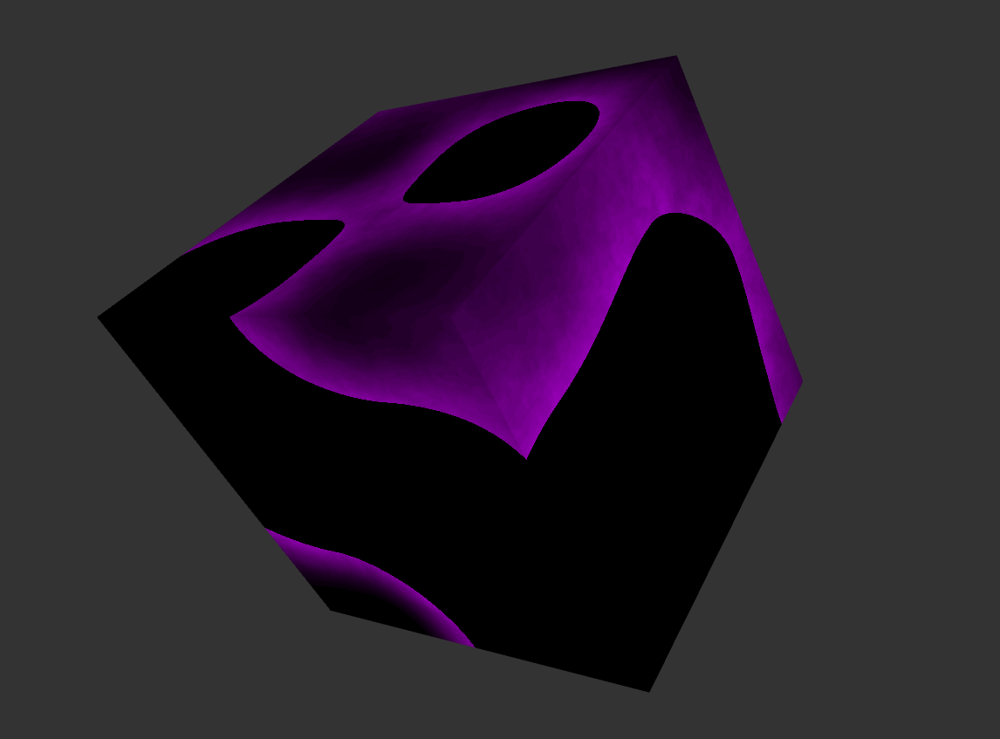
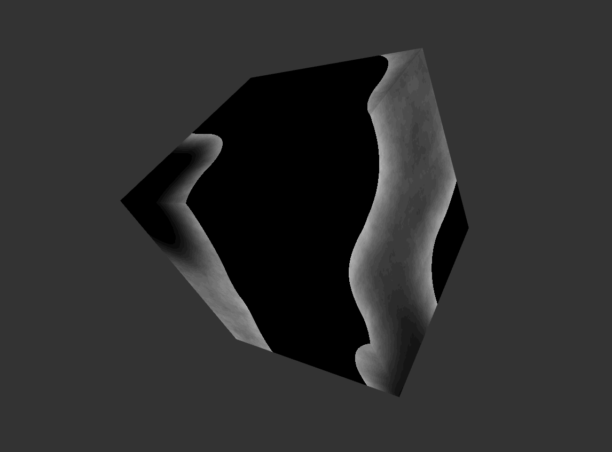
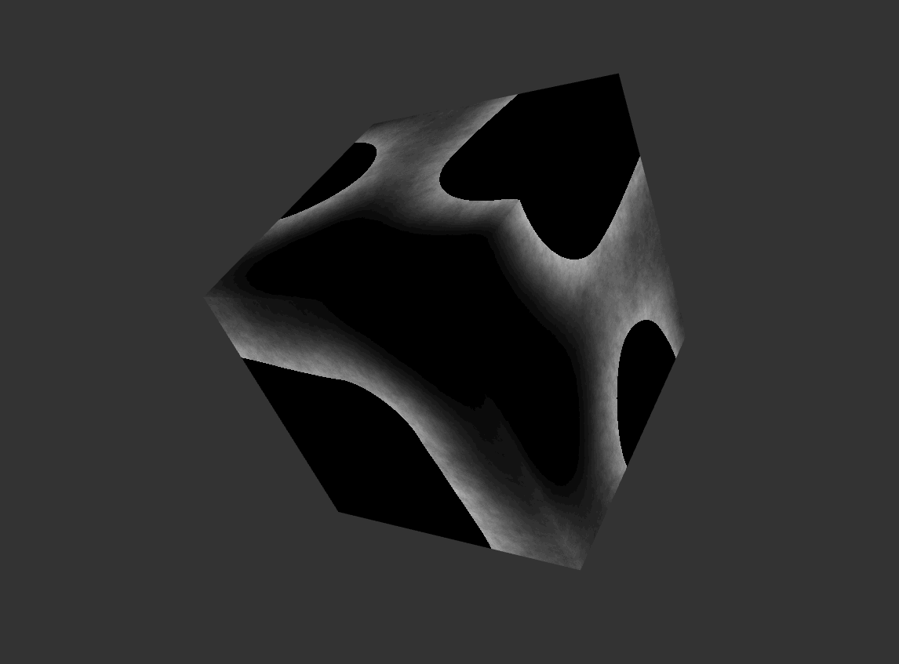

# HW 0: Intro to Javascript and WebGL

[Live Demo](https://www.wuwayne.com/cis566-hw00-intro-base/) 

## Overview
This project implements a simple 3D application using WebGL/Javascript. 
The 3D application draws a simple cube with the 8 vertices displaced non-uniformly.
Two noise patterns are applied to the cube for coloring. 
The first noise is a static and higher frequency noise implemented using fractional brownian motion (FBM) with Perlin noise.
The scale and persistency of FBM can be adjusted through the GUI.
The second noise pattern, which is animated over time and has lower frequency, is implemented using a simple pseudo-random value noise.

## Screenshots

The screenshot below shows the change in persistency and scale for the FBM noise.

User can also tweak the displacement amount and frequency.

## References
* https://adrianb.io/2014/08/09/perlinnoise.html
* https://www.shadertoy.com/view/Xsl3Dl 
* https://thebookofshaders.com/11/ 
